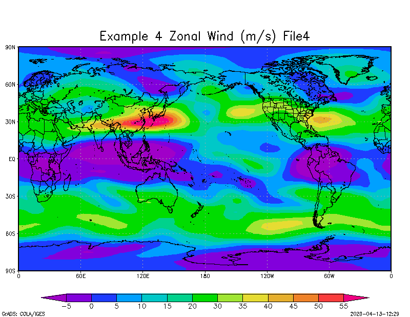

# Guía Adicional al uso de GrADS 
## Meteorología Sinóptica I 2020
### Manuel Chaves A
Info: *mchaves94@gmail.com*

La siguiente guía es de uso adicional al material provisto por el profesor del curso. Se detallaran tres ejemplos de uso común y un cuarto para ejemplificar el uso de ___grads scripting language___ (GSL) de ahora en adelante.

Cualquier duda o error no dudar en comunicarse.

Se adjuntan todos los archivos usados. 

#### Información importante usuarios de *Windows* *: 

* Guarde la carpeta con los archivos y _scripts_ en la ubicación de su preferencia.


* Copie la dirección de esta ubicación de la barra de direcciones.


* Con la ayuda del buscador encuentre la terminal bajo el nombre: *Símbolo del Sistema*.
* Ábralo.


* Pegue la dirección que copio anteriormente precedido de, *_cd_* , como se muestra en la imagen:


* Ejecute (*Enter*)
* Escriba ```opengrads``` y ejecute. 


Lo anterior es requerido, ya que la instalación que se hace por defecto, deja al programa en una ubicación distinta a la que se podría necesitar (_la mayoría de las veces_) como en este caso.
 
***
Antes de seguir adelante se asume que el tutorial básico de *GrADS* ya fue consultado, en la dirección: 
http://cola.gmu.edu/grads/gadoc/tutorial.html

Además la guía de usuario: 
http://cola.gmu.edu/grads/gadoc/users.html

GSL Intro:
http://cola.gmu.edu/grads/gadoc/script.html#intro

Recursos *adicionales* a los oficiales de la documentación: 
* Guía de GrADS
https://www.cpc.ncep.noaa.gov/products/international/grads/Advanced_GrADS_Manual.pdf

* Guía útil sobre barras de color y gráficos: (Página de **CK**)
http://kodama.fubuki.info/wiki/wiki.cgi/GrADS/script/color.gs?lang=en


### Ejemplo 1: Grafico de Viento Zonal
Abra el archivo adjunto ```ejemplo1.gs```. Cuando se trabaja con scripts de GrADS estos deben de llevar la extensión ```.gs```. Para ejecutar el ejemplo en la terminal de grads: 

Los comentarios en un GSL se definen con *.

```bash
ga -> run ejemplo1.gs
```

Y se debería de obtener la siguiente imagen: 


Algunos puntos importantes sobre este primer ejemplo: 

* Los comandos de GrADS cuando se trabaja en un script llevan comillas `""` y se debe siempre tener cuidado
con la cantidad de espacios que se dejan por ejemplo: 

`set_display_color_white`

Tiene 0 espacios al inicio, un espacio después del `set`, un espacio después del `display`. GrADS es _sensible_ a espacios mal colocados.

* Note que un archivo *.nc* siempre se abre con el comando `sdfopen`

* El archivo *NetCDF* usado *U.nc* tiene como variable de viento zonal `uwnd` esto se sabe de antemano
al utilizar el comando `q file`

* La barra de color aparece, ya que el comando en la línea 43
`run cbarn.gs` abre el script complementario. Es decir, es **parecido** a cargar un paquete en algún lenguaje de programación

* Estos *scripts ya preparados* se pueden encuentran en http://cola.gmu.edu/grads/gadoc/library.html con la descripción necesaria.

* Se puede cambiar los colores de esta paleta de color siguiendo las instrucciones en: http://cola.gmu.edu/grads/gadoc/colorcontrol.html

### Ejemplo 2: Grafico de Líneas de Corriente
Los comentarios en un GSL se definen con *.

Abra el archivo adjunto ```ejemplo2.gs```. Cuando se trabaja con scripts de GrADS estos deben de llevar la extensión ```.gs```. Para ejecutar el ejemplo en la terminal de grads: 

```bash
ga -> run ejemplo2.gs
```

Y se debería de obtener la siguiente imagen: 


Algunos puntos importantes sobre este segundo ejemplo: 

* Note que para graficar lines de corriente necesita los archivos de viento Zonal y Meridional: *U.nc* y *V.nc*

* En la sección de **Formato a líneas de Corriente** en la línea 27. Se puede editar el color, grosor y densidad de las mismas, siguiendo las convenciones de la documentación de GrADS.

* Para desplegar la líneas note que se usa el comando, `d uwnd.1;vwnd.2`. Esto hace referencia a que la variable del archivo 1 `uwnd` se despliega de forma vectorial con la variable del archivo 2 `vwnd`.

### Ejemplo 3: Grafico de Variable con barra de color personalizada
Abra el archivo adjunto ```ejemplo3.gs```. Cuando se trabaja con scripts de GrADS estos deben de llevar la extensión ```.gs```. Para ejecutar el ejemplo en la terminal de GrADS: 

Los comentarios en un GSL se definen con *.

```bash
ga -> run ejemplo3.gs
```

Y se debería de obtener la siguiente imagen: 


Algunos puntos importantes sobre este segundo ejemplo: 

* De nuevo, este GSL necesita dos scripts (previamente adjuntados): `xcbar.gs` y `color.gs`. Estos se encuentran en la página de **CK**, con las explicaciones necesarias.

* En la linea 30 se puede definir el intervalo para "colorear" el grafico, de la siguiente manera:

´color [inicio] [final] [paso]´

Que para este caso seria: `color 0 90 5`
Inicio = 0
Final = 90
Paso = Cada 5

* Los colores elegidos `mintcream->lightskyblue->skyblue->dodgerblue->royalblue->navy` son tomados de la guia de **CK** y deben de tener esa misma sintaxis `->`

### Ejemplo 4: Usando GSL para generar gráficos.

El siguiente es un ejemplo de como se puede usar GSL para generar gráficos.

**Suponga que requiere generar varios gráficos como los del ejemplo 1, con múltiples* * archivos de viento zonal. Cada uno con diferente titulo**

La utilidad de Ejemplo radica en que no es necesario correr una y otra vez el mismo script cambiando el nombre de archivo y el titulo por separado. El ejemplo usa solo 4 archivos pero claramente es a modo de demostración y se puede extender a más.

Algunos puntos importantes sobre este segundo ejemplo: 

* Note que los 4 archivos solo varían por el nombre en el número, es esto lo que se va a iterar en el ciclo. Por medio de la variable `file`

* Sintaxis: Notar que se necesita de 4 espacios de indentación.

* El comando `reinit` es necesario para borrar de GrADS graficos y atributos del archivo previo.

* Para combinar comandos con la variable del ciclo `while`, se cierran las comillas se usa la variable y se vuelven a usar comillas si al comando le quedan instrucciones. Por ejemplo:

`"sdfopen U"file".nc"`


Al correr este GS se obtienen las siguientes imágenes.




